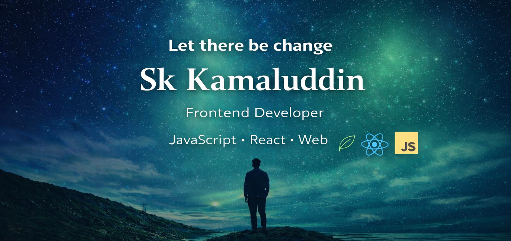

 

 

<h1 align="center">
  
  Hi, I'm Sk Kamaluddin
</h1>

  

<h3 align="center">As a Junior Web Developer, I’m passionate about the frontend
</h3>
<h1 style="margin-bottom: 6px;">💫 About Me</h1>

  

  ✍️ I'm a passionate **Frontend Developer** who loves turning ideas into  
   clean, responsive, and user-friendly web experiences.

- 🌱 Currently learning **HTML, CSS, JavaScript**
- 🎯 Focused on UI design & real-world projects
- 💡 Improving logic, performance & best practices
- 🔥 Goal: Professional Frontend Engineer

 
<h2>🌐 Connect with me</h2>
<h3 align="center">Connect with me:</h3>

  

  

<h2>Frontend Skills</h2>

  

## Tools

  

## 🏆 GitHub Trophies

  

## ✍️ Random Dev Quote

  

## ⭐ Featured Projects
- 🪨 **Rock Paper Scissors Game**  
  🔗 https://kamalcodezen.github.io/Rock-Paper-Scissors-web/

- ❌⭕ **Flower Animation Web**  
  🔗 https://kamalcodezen.github.io/flower-animation-repo/

  

  

